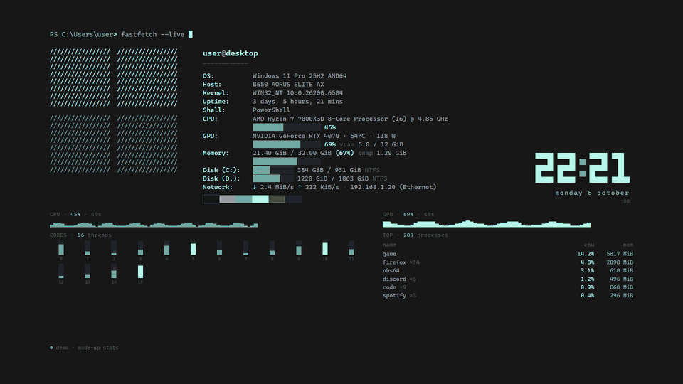
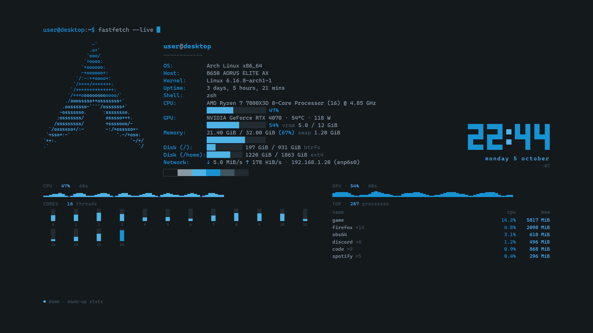
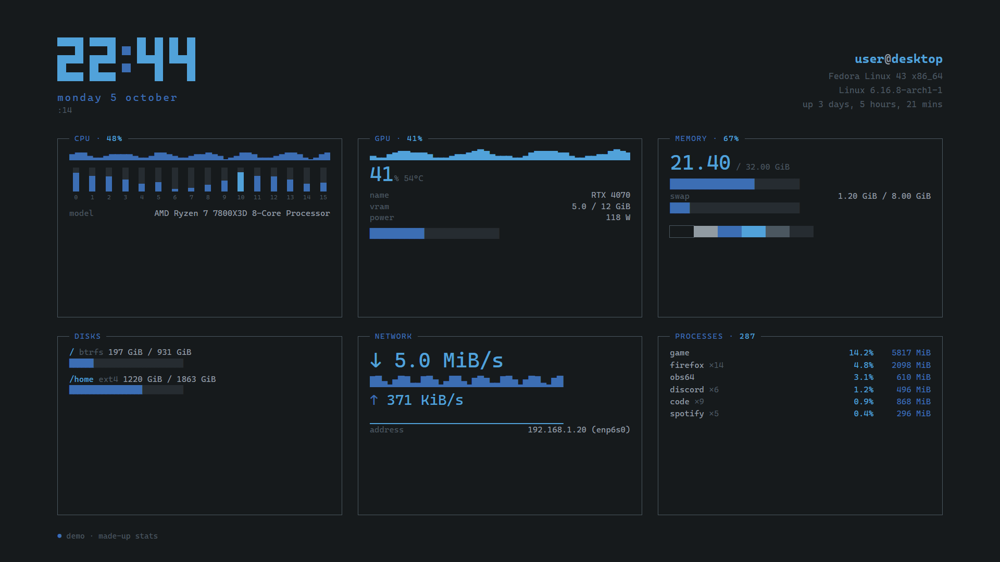
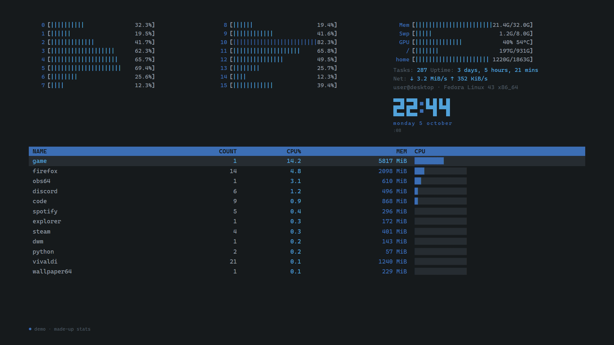
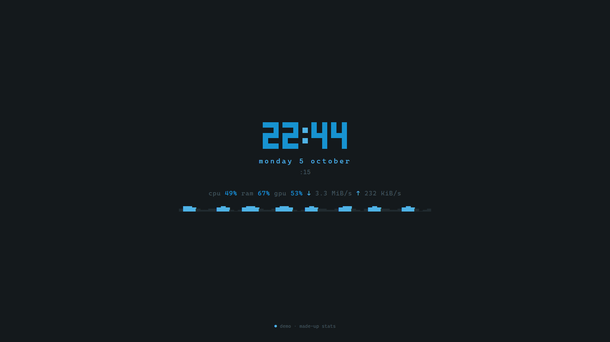
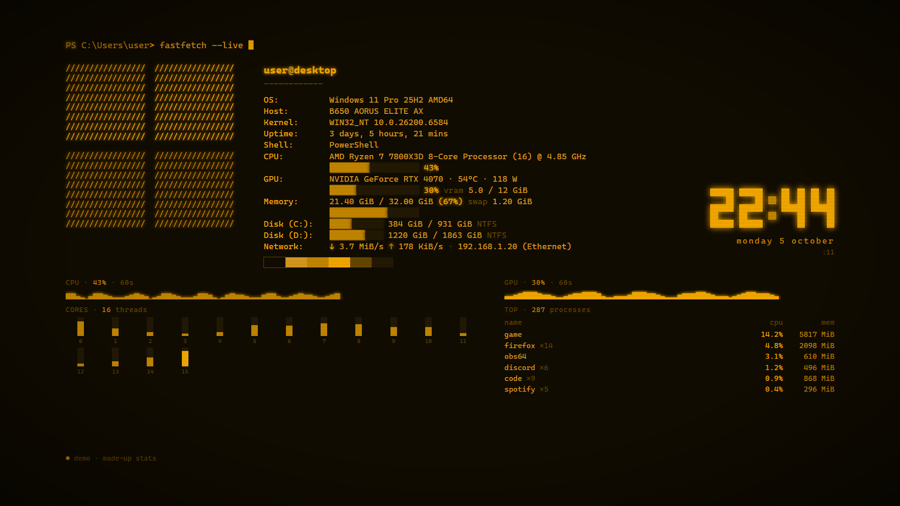
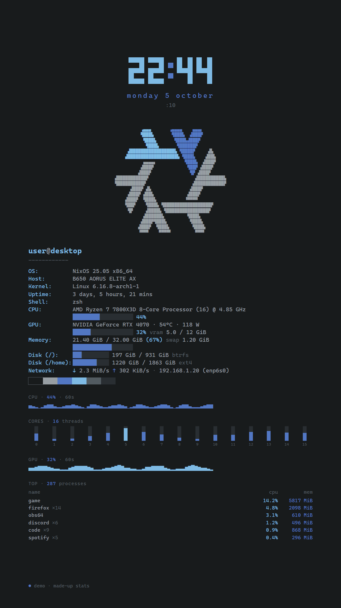

# termwall

A live system-stats wallpaper in the style of [fastfetch](https://github.com/fastfetch-cli/fastfetch):
system info, per-core CPU, CPU and GPU history, memory, disks, network and top processes,
refreshed every second. Five layouts, fourteen built-in themes, your distro's logo and colors
on Linux, and a palette that can follow your wallpaper.



| fetch | board | htop |
|---|---|---|
|  |  |  |

| minimal | the amber theme with `effects crt,glow` | portrait |
|---|---|---|
|  |  |  |

The pictures come from the demo mode (`index.html?demo`) with made-up stats.

## Requirements

- **Windows 10 or 11**, 64-bit.
- **Something that shows a web page as a wallpaper**: [Lively Wallpaper](https://github.com/rocksdanister/lively)
  (free, open source: `winget install rocksdanister.LivelyWallpaper`) or
  [Wallpaper Engine](https://store.steampowered.com/app/431960/) (paid, Steam). termwall is
  the page; one of these puts it on the desktop.
- Linux: the stats work, the wallpaper host is untested. See [Linux](#linux).

## Install

Download `termwall-setup-X.Y.Z.exe` from [Releases](https://github.com/PantoYT/termwall/releases)
and run it. No admin rights, nothing else to install.

- Installs to `%LOCALAPPDATA%\Programs\termwall` with its own Python.
- Starts the stats server now and at every logon.
- Adds termwall to Wallpaper Engine (a link in `projects\myprojects`) and to Lively's library,
  whichever you have. In Lively, restart it once to see termwall in the library.
- Uninstall: Windows' Apps list. It stops the server and removes the autostart and both
  links.

A winget package is in review; once it's accepted: `winget install PantoYT.termwall`.

The installer also puts a `termwall` command on your PATH (in new terminals):
`termwall --style layout board`, `termwall --version`.

## Configuration

termwall reads two optional files from its folder (`%LOCALAPPDATA%\Programs\termwall` after
the installer, the repo folder otherwise). Both are picked up within a second, without
reloading the wallpaper.

**The look**: `termwall.json`, written by `termwall --style KEY VALUE` (`termwall --style`
alone lists everything with its current value; `KEY default` removes one, `reset` all):

| setting | values | default |
|---|---|---|
| `layout` | `fetch` (fastfetch), `board` (boxes, like btop), `htop` (meters and a big process table), `minimal` (the clock and one line), `portrait` (for a monitor on its side) | `fetch` |
| `theme` | `auto`, `mint`, `catppuccin`, `gruvbox`, `nord`, `dracula`, `tokyo-night`, `rose-pine`, `everforest`, `kanagawa`, `solarized`, `one-dark`, `monokai`, `amber`, `phosphor` (`termwall --themes`, or `termwall --theme nord`) | `auto`: your distro's colors on Linux, mint on Windows |
| `colors` | your own six colors, edited into `termwall.json` by hand: `"colors": {"bg": "#…", "accent": …}` | |
| `bars` | `blocks`, `shade`, `dots`, `line` | `blocks` |
| `hide` | any of `prompt`, `logo`, `info`, `clock`, `cpu`, `cores`, `gpu`, `memory`, `disks`, `network`, `procs`, `swatches`, `music`, `status` (`termwall --style hide gpu,procs`; `none` shows all) | nothing |
| `clock` | `24h`, `12h` | `24h` |
| `seconds` | `on`, `off` | `on` |
| `date` | `long` (monday 5 october), `short`, `iso`, `none` | `long` |
| `prompt` | the command in the prompt line, any text up to 60 characters | `fastfetch --live` |
| `private` | `on` hides your user name, computer name and local IP (for streams and screenshots) | `off` |
| `logo` | `auto`, `windows`, `tux`, `none`, or any distro's (`arch` on Windows works) | `auto` |
| `font` | `cascadia`, `jetbrains`, `fira`, `iosevka`, `consolas`, `system` (the font must be installed; otherwise the next one in line is used) | `cascadia` |
| `scale` | `0.8` to `1.1`: smaller fits more, larger makes everything bigger | `1.0` |
| `effects` | `crt` (scanlines and a vignette), `glow` | none |
| `rotate` | minutes between layouts, `0` = off | `0` |

**The palette**: `theme.json`, six `#rrggbb` colors:

```json
{"bg": "#171717", "accent": "#b5f4e7", "secondary": "#7faca3",
 "text": "#939fa1", "dim": "#4b5252", "faint": "#242626"}
```

A wallpaper switcher writes this file on every switch:
[livery](https://github.com/PantoYT/livery) (also by me) changes the wallpaper and recolors
Discord, Spotify, browsers, RGB and termwall in one keypress. While `theme.json` exists, its
palette beats `theme` and `colors`; delete it to use your own again. It may also carry a
`"style"` object (`{"layout": "minimal"}`) with any of the settings above, so each palette
can have its own look.

**What wins**, highest first:

| source | sets | applies |
|---|---|---|
| URL `?layout=…&hide=…&effects=…` and the other settings | the look | always (handy in a browser) |
| URL `?demo&bg=…&accent=…` (all six) | palette | demo mode only |
| `"style"` in `theme.json` | the look | always |
| `termwall.json` | the look | always |
| `theme.json` palette | colors | always |
| `colors` in `termwall.json` | colors | without `theme.json` |
| `theme` in `termwall.json` | colors | without `theme.json` and `colors` |
| your distro's colors | colors | Linux, `theme` auto |
| built-in defaults | everything | otherwise |

`TERMWALL_THEME` and `TERMWALL_STYLE` (environment variables) point the server at other
files. The port, `127.0.0.1:9002`, is fixed.

## Troubleshooting

| problem | what to check |
|---|---|
| the wallpaper is empty, "api offline" at the bottom | the stats server isn't running: start it (`termwall-api.vbs`, or log off and on after the installer). Check it with `http://127.0.0.1:9002/health` in a browser: it shows the version and request counters when it runs (`/stats` itself answers `403` in a browser, that's the token below, not an error) |
| the server won't start: "port 9002 is taken" | another termwall is already running (a manual one next to the installed one?) |
| GPU shows `n/a` | only NVIDIA cards are read (through `nvidia-smi`); AMD and Intel GPUs show `n/a` |
| Wallpaper Engine shows an old version after an update | WE plays its own copy of termwall: use the installer, or a junction ([Manual setup](#manual-setup)) |
| colors or layout don't change | check the JSON in `theme.json` / `termwall.json` is valid: an invalid file is ignored |

## How it works

A browser can't read CPU or GPU usage, so termwall has two halves: the page (`index.html`)
and a small local server (`termwall_api.py`, "the server" in this README) that the page asks
once a second.

| file | what it is |
|---|---|
| `index.html` | the wallpaper: one page, no dependencies |
| `logos.js` | distro logos (from fastfetch, see [Credits](#credits)) |
| `termwall_api.py` | the server: psutil for the stats, `nvidia-smi` for an NVIDIA GPU |
| `termwall-api.vbs` | starts the server without a console window (manual setup) |
| `project.json` | Wallpaper Engine's project file |

The server samples in the background (every second; GPU every 2 s, processes every 3 s), so
a request never waits. Endpoints: `/stats` (everything), `/theme` (palette and look only,
polled four times a second so a palette switch lands fast), `/health` (version and request
counters, the only one without the token).

`/stats`, shortened from a real `--once` (sizes in bytes, rates in bytes/s, `cpu_freq`
and GPU clock in MHz, `vram_*` in MiB, `uptime` in seconds, percentages 0-100):

```json
{"user": "…", "host": "…", "os": "Windows 11 Home 26H2 AMD64", "os_family": "windows",
 "distro": "", "kernel": "…", "board": "…", "cpu_model": "…", "cores": 24, "shell": "PowerShell",
 "cpu": 24.5, "cores_pct": [62.1, 54.6, 59.0, "…"], "cpu_freq": 3801, "uptime": 7047,
 "ram": {"used": 20014813184, "total": 34254348288, "percent": 58.4},
 "swap": {"used": 275476480, "total": 34359738368, "percent": 0.8},
 "gpu": {"name": "NVIDIA GeForce RTX 3060", "util": 17.0, "temp": 42.0, "vram_used": 2257.0,
         "vram_total": 12288.0, "power": 22.03, "clock": 502.0},
 "net": {"down": 1727.9, "up": 7978.8}, "local_ip": "…",
 "disks": [{"mount": "C:", "fs": "NTFS", "used": 180259778560, "total": 248909918208, "percent": 72.4}],
 "procs": [{"name": "vmmemWSL", "cpu": 8.7, "mem": 633786368, "count": 1}], "procs_total": 437,
 "history": {"cpu": ["… 60 values"], "gpu": ["…"], "down": ["…"], "up": ["…"]},
 "theme": null, "style": {"layout": "fetch", "bars": "blocks", "rotate": 0}, "page": 1791231708683}
```

`gpu` is `null` without an NVIDIA card.

**Privacy and security.** The server listens on `127.0.0.1` only, so nothing on your network
can reach it. Its answers include your user name, computer name, local IP and process names,
so every request (but `/health`) must carry a random token from `token.js`, which the server
rewrites at each start. Web pages in your browser can't read local files, so they get `403`.
(Programs running as you can read the token, but they could read the same stats directly
anyway.) The `Host` header must be `127.0.0.1` or `localhost`, against DNS rebinding.
Nothing is sent anywhere.

## Manual setup

From the repo (tested on Python 3.12 to 3.14):

```
pip install psutil
python termwall_api.py --selftest
```

1. Autostart: a shortcut to `termwall-api.vbs` in `shell:startup` (Win+R → `shell:startup`).
2. Wallpaper Engine → **Open wallpaper** → **Open from file** → `index.html`. WE then plays
   its **own copy** in `projects\myprojects\termwall`, which never sees your edits. Replace
   it with a junction once, in **cmd** (not PowerShell: `mklink` is a cmd command):

   ```
   rmdir /s /q "C:\Program Files (x86)\Steam\steamapps\common\wallpaper_engine\projects\myprojects\termwall"
   mklink /J "C:\Program Files (x86)\Steam\steamapps\common\wallpaper_engine\projects\myprojects\termwall" "C:\path\to\termwall"
   ```

   (Your Steam library may be elsewhere.) The server can also make the link:
   `python termwall_api.py --link-we`, and for Lively `--link-lively`.
3. The page reloads itself when `index.html` changes, so edits show up live.

Uninstall: delete the shortcut from `shell:startup`, then `python termwall_api.py --unlink-we`
(or `rmdir` the junction: that removes only the link).

| command | does |
|---|---|
| `python termwall_api.py` | run the server |
| `--once` | print one sample and exit |
| `--selftest` | run the self-test |
| `--style [KEY VALUE]` | show or change the look |
| `--link-we` / `--unlink-we` | the Wallpaper Engine link |
| `--link-lively` / `--unlink-lively` | the Lively library entry |
| `--stop` | stop this folder's server |
| `--version` | the version |

**Building the installer**: `installer\build.ps1` (needs Inno Setup 6). GitHub Actions builds
it on every `v*` tag, installs it silently, checks the server answers, uninstalls it and
publishes the release. `tools\fetch_logos.py` rebuilds `logos.js`.

**Demo mode**: `index.html?demo` (made-up stats, no server) takes the look's settings in the
URL (`&layout=htop&effects=crt`), a palette (`&bg=…&accent=…`, all six, hex without `#`),
`&distro=arch` or `&distro=cycle` (every logo, five seconds each).

## Linux

The server works on Linux: it reads the distro from `/etc/os-release`, the CPU from
`/proc/cpuinfo`, the board from DMI, and skips pseudo filesystems (snaps, Docker overlays).
Tested on Ubuntu 24.04. The page shows your distro's logo (about 25 distros; derivatives get
their parent's through `ID_LIKE`, the rest a Tux) and, without a `theme.json`, its colors.

Running the server: `pip install psutil`, then `python3 termwall_api.py` (`--selftest`
first, if you like). To start it at login, use your desktop's autostart or a systemd user
unit; neither is set up for you.

**Not tested: what puts the page on the desktop.** Wallpaper Engine and Lively are
Windows-only; a tool that uses a web page as a wallpaper should work (KDE Plasma has
wallpaper plugins for that), but none has been tried. No installer for Linux either.

## Credits

- The look imitates [fastfetch](https://github.com/fastfetch-cli/fastfetch), and the distro
  logos in `logos.js` are fastfetch's (MIT, Copyright (c) 2021-2023 Linus Dierheimer,
  2022-2026 Carter Li; the full license is at the top of `logos.js`). termwall is not
  affiliated with fastfetch.
- The Windows logo is fastfetch's `windows_11` shape.

## License

MIT, see [LICENSE](LICENSE).
