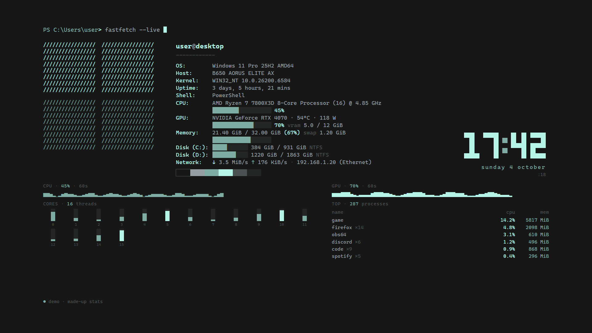

# termwall

A live, fastfetch-style system-stats wallpaper for Wallpaper Engine and Lively Wallpaper:
system info, per-core CPU bars, CPU/GPU history, memory, disks, network and top processes,
refreshed every second. Three layouts; the palette can follow your wallpaper.



| board | minimal |
|---|---|
|  |  |

Install: `winget install PantoYT.termwall` (once the package is in winget), or
`termwall-setup-X.Y.Z.exe` from [Releases](https://github.com/PantoYT/termwall/releases).
Screenshots are from the demo mode (`index.html?demo`), with made-up stats.

Designed for 1920×1080 and scaled (and centered) to whatever screen it lands on.
Default palette: `#171717` background, `#b5f4e7` mint, `#7faca3` teal, `#939fa1` grey.
Font: Cascadia Mono (falls back to Consolas).

## Live palette

Drop a `theme.json` next to the API (or point `TERMWALL_THEME` at one) and the
wallpaper recolors within a second — only CSS variables change, Wallpaper Engine
doesn't reload anything:

```json
{"bg": "#171717", "accent": "#b5f4e7", "secondary": "#7faca3",
 "text": "#939fa1", "dim": "#4b5252", "faint": "#242626"}
```

All six keys, `#rrggbb` only; anything invalid is ignored and the defaults stay.
`theme.json` is machine state, so it's gitignored. A switcher just rewrites this file;
[livery](https://github.com/PantoYT/livery) does it on every wallpaper switch.

## Parts

| File | What it is |
|---|---|
| `index.html` | the wallpaper (single file, no dependencies) |
| `termwall_api.py` | read-only stats server on **127.0.0.1:9002** (`/stats`), psutil + nvidia-smi |
| `termwall-api.vbs` | starts the API in the background without a console window (autostart) |
| `project.json` | Wallpaper Engine project file (type `web`) |

The browser can't read CPU/GPU usage, so the wallpaper polls the local API once per
second. The API binds to localhost only — it's never reachable from the LAN.

## Install

**Installer** (Windows 10/11, no admin, nothing else to install): `termwall-setup-X.Y.Z.exe`
from [Releases](https://github.com/PantoYT/termwall/releases). It brings its own Python
with psutil, starts the stats server at logon, and adds termwall to Wallpaper Engine (a
junction in `projects\myprojects`) and to Lively Wallpaper's library, whichever you have.
Uninstalling removes all of that. termwall needs one of those two to be shown as a
wallpaper: [Lively](https://github.com/rocksdanister/lively) is free and open source.

Building it: `installeruild.ps1` (needs Inno Setup 6); GitHub Actions builds it on every
`v*` tag, installs it silently, checks the server answers, uninstalls, and publishes it.

## Setup by hand

```
pip install psutil
python termwall_api.py --selftest
```

1. Autostart: put a **shortcut** to `termwall-api.vbs` in `shell:startup` (the launcher finds `termwall_api.py` next to itself and uses `pythonw` from PATH).
2. Wallpaper Engine → **Open wallpaper** → **Open from file** → pick `index.html`, then
   choose the monitor.

"Open from file" makes Wallpaper Engine keep its **own copy** under
`projects\myprojects\termwall`, so later edits don't reach it. Replace that copy with a
junction to the repo once:

```
rmdir /s /q "<WE>\projects\myprojects\termwall"
mklink /J "<WE>\projects\myprojects\termwall" "<repo>\termwall"
```

After that the page reloads itself whenever `index.html` changes (the API reports the
file's mtime), so there's nothing to re-add.

Inside Wallpaper Engine the currently playing track also appears under the clock
(Wallpaper Engine's media integration); in a normal browser that line stays empty.

## Looks

Preview any look in a browser without the API: `index.html?demo&layout=board` (add
`&bars=dots`, or a palette as `&bg=171717&accent=b5f4e7&secondary=7faca3&text=939fa1&dim=4b5252&faint=242626`).

Three layouts and four bar styles, switched live (no wallpaper reload):

| setting | values |
|---|---|
| `layout` | `fetch` (the fastfetch screen), `board` (btop-like boxes), `minimal` (the clock and one line of stats) |
| `bars` | `blocks`, `shade`, `dots`, `line` |
| `rotate` | minutes between layouts, `0` = off |

```
python termwall_api.py --style                # what is set now
python termwall_api.py --style layout board   # change one
python termwall_api.py --style rotate 20      # a different layout every 20 minutes
```

They live in `termwall.json` next to the API (gitignored). A `"style"` object inside
`theme.json` wins over it, so a palette switcher can give each palette its own look:
`{"bg": "#171717", ..., "style": {"layout": "minimal", "bars": "dots"}}`.

The clock's digits are one SVG per glyph, so there are no seams between their pixels.

## Other systems

**Distro logos and colors.** On Linux the logo is your distro's, from
[fastfetch](https://github.com/fastfetch-cli/fastfetch) (MIT; its license is at the top of
`logos.js`, built by `tools/fetch_logos.py`): about 25 distros by os-release `ID`, their
derivatives through `ID_LIKE`, a Tux for the rest. Without a palette from outside
(`theme.json`), termwall wears the distro's own colors. Preview: `index.html?demo&distro=arch`.


- **Linux**: the API reads the distro from `/etc/os-release`, the CPU from
  `/proc/cpuinfo`, the board from DMI, and skips pseudo filesystems (snaps, Docker
  overlays). Tested on Ubuntu 24.04 (selftest and a live snapshot). The page shows a Tux
  and a `user@host:~$` prompt there.
- **What's missing on Linux is the wallpaper host**: Wallpaper Engine is Windows-only.
  Any tool that can use a web page as a wallpaper works (KDE Plasma's web-page wallpaper
  plugins, for example); none has been tried yet.
- `nvidia-smi` is optional everywhere; without it the GPU shows `n/a`.

## API

```
python termwall_api.py            # serve
python termwall_api.py --once     # print one snapshot
python termwall_api.py --selftest # 34 assertions
```

A background thread samples once per second (GPU every 2 s, processes every 3 s), so a
request never waits on psutil or nvidia-smi. Without `nvidia-smi` the `gpu` field is
`null` and the wallpaper shows `n/a`.
